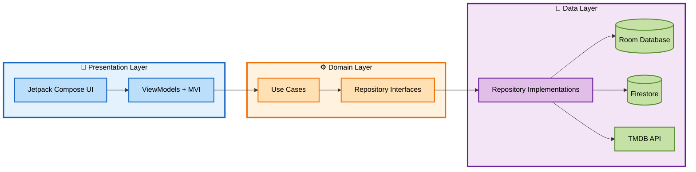
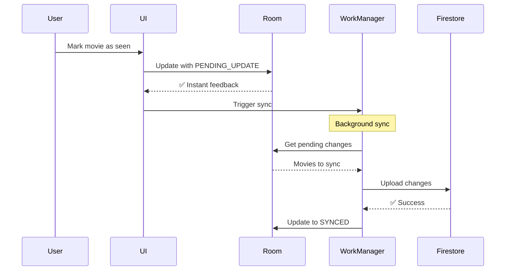
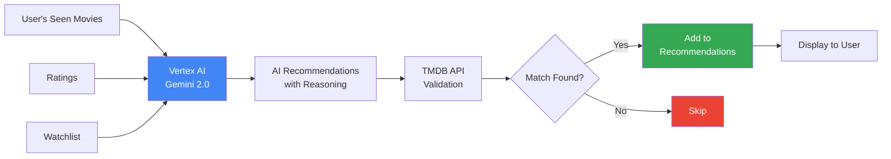

# MoviQ

[](https://developer.android.com/)
[](https://kotlinlang.org/)
[](https://developer.android.com/about/versions/marshmallow)
[](https://developer.android.com/)

> A production-ready Android app demonstrating modern architecture, AI integration, and best practices. Built as a reference for developers and to showcase professional Android development skills.

## 🎬 What is MoviQ?

| 🎬 Track Movies You Watch | ❤️ Rate & Mark Your Favorites | ✨ Get AI Recs on What to Watch | 🔎 Find New Films Tailored to You |
| - | - | - | - |
|  |  |  |  |


---

## 🏗️ Architecture

Built with **Clean Architecture** + **MVI Pattern** following [Google's recommended architecture](https://developer.android.com/topic/architecture).



| Layer | Responsibilities | Key Technologies |
|-------|------------------|------------------|
| **Presentation** | UI components, ViewModels, state management | Jetpack Compose, Material 3, MVI |
| **Domain** | Business logic, use cases, repository contracts | Kotlin, Coroutines, Flow |
| **Data** | Data sources, repositories, sync logic | Room, Firestore, Retrofit, WorkManager |

<details open>
<summary><b>📋 Key Architectural Patterns</b></summary>

- **Offline-First:** Room as single source of truth with cloud sync
- **Unidirectional Data Flow:** MVI pattern with sealed classes
- **Dependency Injection:** Hilt for compile-time DI
- **Background Sync:** WorkManager with conflict resolution
- **Repository Pattern:** Abstract data sources from business logic
- **Use Case Pattern:** Single responsibility for each business operation

</details>

---

## 🛠️ Tech Stack

<details open>
<summary><b>Core Android</b></summary>

- **Jetpack Compose** - UI
- **Material 3** - Google's Current Design System
- **Hilt** - Dependency injection
- **Navigation Compose** - Type-safe navigation
- **Lifecycle & ViewModel** - State management

- **Additional Features:** Cloud sync across devices • Google Sign-In • In-app purchases • Dark mode • Offline-first

</details>

<details>
<summary><b>Data & Networking</b></summary>

- **Room** - Local database (SQLite)
- **Retrofit** - REST API client
- **Coil** - Image loading & caching
- **DataStore** - Preferences storage
- **WorkManager** - Background tasks

</details>

<details>
<summary><b>Firebase Services</b></summary>

- **Authentication** - Google Sign-In
- **Firestore** - Cloud database
- **Vertex AI** - Gemini 2.0 for recommendations
- **Crashlytics** - Error tracking
- **Analytics** - User insights

</details>

<details>
<summary><b>Testing</b></summary>

- **JUnit 4** - Unit testing
- **Truth** - Assertions
- **Espresso** - UI testing
- **Compose Test** - Compose UI tests
- **Hilt Testing** - DI in tests

</details>

---

## 📁 Project Structure

Feature-based modularization with clear separation of concerns:

```
app/src/main/java/com/dthurman/moviesaver/
│
├── 🎯 core/                    # Shared functionality
│   ├── app/                    # MainActivity, Navigation, Scaffold
│   ├── data/                   # Room DB, sync logic
│   ├── domain/                 # Core models (Movie, User)
│   └── observability/          # Analytics & error logging
│
├── 🎬 feature_movies/          # Movie management
│   ├── data/                   # TMDB API, Firestore sync
│   ├── domain/                 # 8 use cases (search, rate, etc.)
│   └── presentation/           # Discover, Detail, My Movies screens
│
├── 🤖 feature_ai_recs/         # AI recommendations
│   ├── data/                   # Vertex AI integration
│   ├── domain/                 # 7 use cases
│   └── presentation/           # Recommendations screen
│
├── 🔐 feature_auth/            # Authentication
├── 💳 feature_billing/         # In-app purchases
└── 🎨 ui/                      # Shared components & theme
```

---

## 🔄 Offline-First Sync Strategy


**How it works:**
1. User action updates Room immediately (instant UI feedback)
2. Item marked with sync state
3. WorkManager syncs to Firestore in background
4. Conflict resolution uses timestamps (most recent wins)
5. Periodic sync every 6 hours + on-demand triggers

---

## 🤖 AI-Powered Recommendations

Uses **Firebase Vertex AI (Gemini 2.0 Flash)** to analyze your movie history and generate personalized suggestions.



**Process:**
1. Analyzes your seen movies + ratings
2. Sends structured prompt to Gemini 2.0
3. AI returns 5 movie suggestions with reasoning
4. Validates against TMDB API
5. Filters duplicates and already-seen movies

**Requirements:** Minimum 5 seen movies • 1 credit per generation

---

## 🧪 Testing

Comprehensive test coverage with **50+ tests** across unit, integration, and E2E.

| Test Type | Framework | Count | Coverage |
|-----------|-----------|-------|----------|
| **Unit Tests** | JUnit + Truth | 30+ | Use cases, ViewModels |
| **UI Tests** | Compose Test + Espresso | 15+ | Screen interactions |
| **E2E Tests** | Hilt Testing | 5+ | Complete user flows |

**Testing Strategy:**
- [x] Fake repositories for isolation
- [x] Hilt test modules for DI
- [x] Coroutines test for async operations
- [x] Custom `HiltTestRunner` for instrumented tests

<details>
<summary><b>Example Test</b></summary>

```kotlin
@HiltAndroidTest
@UninstallModules(AppModule::class)
class MoviesEndToEndTest {
    @get:Rule(order = 0)
    val hiltRule = HiltAndroidRule(this)
    
    @get:Rule(order = 1)
    val composeRule = createAndroidComposeRule<MainActivity>()
    
    @Test
    fun userCanSearchAndAddMovieToWatchlist() {
        // Complete user flow test
    }
}
```

</details>

---

## 🚀 Getting Started

### Prerequisites
- Android Studio Ladybug | 2024.2.1+
- JDK 21
- TMDB API Key ([Get one here](https://www.themoviedb.org/settings/api))
- Firebase Project ([Create here](https://console.firebase.google.com/))

### Quick Setup

1. **Clone & Configure**
   ```bash
   git clone https://github.com/yourusername/movie-saver.git
   cd movie-saver
   ```

2. **Add `local.properties`**
   ```properties
   MOVIES_API_KEY=your_tmdb_api_key
   ```

3. **Add Firebase**
   - Download `google-services.json` from Firebase Console
   - Place in `app/` directory
   - Enable: Authentication (Google), Firestore, Vertex AI, Crashlytics

4. **Build**
   ```bash
   ./gradlew assembleDebug
   ```

<details>
<summary><b>Detailed Firebase Setup</b></summary>

- [ ] Create Firebase project
- [ ] Add Android app with package name: `com.dthurman.moviesaver`
- [ ] Enable services:
  - [ ] **Authentication** → Google Sign-In provider
  - [ ] **Firestore Database** → Production mode
  - [ ] **Vertex AI** → Enable Gemini API
  - [ ] **Crashlytics** & **Analytics**
- [ ] Add SHA-1 fingerprint:
  ```bash
  ./gradlew signingReport
  ```
- [ ] Download and add `google-services.json`

</details>

---

## 💡 Key Highlights

### For Developers
- [x] Production-ready architecture
- [x] 100% Kotlin & Compose
- [x] Comprehensive testing examples
- [x] Modern Android best practices
- [x] Real-world Firebase integration
- [x] Clean code with SOLID principles

### Technical Achievements
- [x] Offline-first with sync
- [x] AI integration (Vertex AI)
- [x] In-app billing implementation
- [x] Background processing
- [x] Type-safe navigation
- [x] Material 3 theming

## 🤝 Contributing

This is a reference project, but contributions are welcome! Feel free to open issues or submit PRs.


## 📝 License

MIT License - see [LICENSE](LICENSE) file for details.

**Built by David Thurman**

[GitHub](https://github.com/davidthurman) • [LinkedIn](https://linkedin.com/in/david-thurman)

⭐ Star this repo if you find it helpful!
